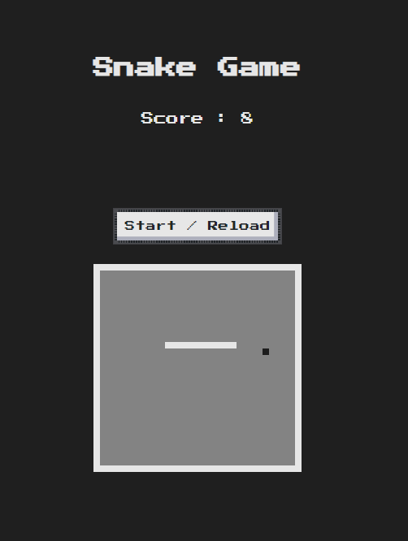

# Classic Snake Game

In the year 2000, Nokia released the Nokia 3310 cell phone, which in addition to being famous for its indestructibility, also featured a highly addictive game called Snake. The object of this game was to control a snake and eat apples, causing the snake to grow in length until it reached a point where it would not fit on the screen.

MOBILE VERSION COMING SOON!!!!

## Table of contents

- [Overview](#overview)
  - [The challenge](#the-challenge)
  - [Screenshot](#screenshot)
  - [Links](#links)
- [My process](#my-process)
  - [Built with](#built-with)
  - [Code explanation](#code-explanation)
  - [Useful resources](#useful-resources)
- [Author](#author)

## Overview

### The challenge

Game should be able to:

- Move the snake in any direction
- See the score update everytime it eats an apple
- Stop when ever the snake hits a wall or itself
- Show the "You Lose" text when the game is over

### Screenshot



### Links

- [Nokia 3310 Snake game video](https://www.youtube.com/shorts/s1reaXh_YwU)
- [Live Site URL](https://rickhalmoguera.github.io/snake-game/)

## My process

### Built with

- Semantic HTML5 markup
- SCSS
- Flexbox

### Code explanation

In this section you can see the explanation of 4 functions used in this project

startGame function

```Js
const startGame = () =>{
    squares = document.querySelectorAll("div")
    squares.forEach(index =>{
        index.classList.remove("snake")
        index.classList.remove("apple")
        }
    )
```
The game does not start when opening the browser, but it is the player who does it through the "Start/Reload" button.

When clicking, the program will create a Node List with all the elements that are Div (this is how the grid where our snake will be) is created and to ensure that there are no errors, remove all the "snake" and "apple" classes

```Js
clearInterval(interval)
    currentSnake = [2,1,0]
    snakeCurrentPosition = 0
    direction = 1
    speed = 0.1
    score = 0
    winLoseDisplay.innerText = ""
    deployApple()
    interval = setInterval(checkOutOfBounds, intervalTime * speed)
}
```

In this code we return the values to their original value, in addition to deploying the apple and starting our timer that will run the "checkOutofBounds" function.

```Js
const  checkOutOfBounds = () =>{
    if(currentSnake[0] % rowSize == rowSize -1 ){
        winLoseDisplay.innerText = "Your Lose"
        clearInterval(interval)
    }else if(currentSnake[0] % rowSize == 0 ){
        winLoseDisplay.innerText = "Your Lose"
        clearInterval(interval)
    }else if(currentSnake[0] + rowSize >= (rowSize * rowSize) ){
        winLoseDisplay.innerText = "Your Lose"
        clearInterval(interval)
    }else if(currentSnake[0] - rowSize < 0 && direction == - rowSize ){
        winLoseDisplay.innerText = "Your Lose"
        clearInterval(interval)
    }else if(squares[currentSnake[0] + direction].classList.contains('snake')){
        winLoseDisplay.innerText = "Your Lose"
        clearInterval(interval)
    }else if(squares[currentSnake[0] + direction].classList.contains('apple')){
        squares[currentSnake[0] + direction].classList.remove('apple')
        currentSnake.push(currentSnake[currentSnake.length - 1])
        deployApple()
        score ++
        scoreDisplay.innerText = score
    }else{
        moveSnake()
    }
}
```

This function despite being long is simple. Where it checks if the snake has touched any edge, itself or the apple, otherwise it will call the moveSnake function.
In the event that the snake eats an apple, it will make the apple disappear, add 1 to the score and enlarge the snake by one square.

```Js
const moveSnake = () =>{
    const tail = currentSnake.pop()
    squares[tail].classList.remove('snake')
    currentSnake.unshift(currentSnake[0] + direction)
    squares[currentSnake[0]].classList.add('snake')
}
```
How do we make the snake move?
It is the skeleton of the snake, to call it somehow, it is an array where we have 3 values ​​[2,1,0], where 0 is the tail and 2 is the head.

Using the array.pop() method
we removed the "snake" class from where the queue was located in the grid.

this will make the array of the snake that [2,1]

at the same moment, we add to the beginning of the array with the method array.unshift()
the value of position[0] + the address. In the case that it is moving to the right it would be => 2 +1. This generates a new array of snake [3,2,1].
Now with the new array we will paint our new snake in the grid with squares[currentSnake[0]].classList.add('snake')

```Js
window.addEventListener("keydown", () => getDirection(event))
const getDirection = (event)=>{
    
    if(event.key =="ArrowDown" && direction !== -rowSize ){
        direction = + rowSize
    }else if(event.key == "ArrowUp" && direction !== + rowSize ){
        direction = - rowSize
    }else if(event.key == "ArrowLeft" && direction !== + 1 ){
        direction = - 1
    }else if(event.key == "ArrowRight" && direction !== -1 ){
        direction = + 1
    }
}
```

And finally we have how we give direction to the snake.

It is done using an EventListener, with the keydown option.

and in conjunction with the getDirection function we see what key was pressed on the keyboard and we change the value of the direction variable depending on the case.

### Useful resources

- [JavaScript Array pop()](https://www.w3schools.com/jsref/jsref_pop.asp)

- [JavaScript Array unshift()](https://www.w3schools.com/jsref/jsref_unshift.asp)
- [Set Interval](https://www.w3schools.com/jsref/met_win_setinterval.asp)


## Author

- Github - [Ricardo Halmoguera](https://github.com/RickHalmoguera)

- Frontend Mentor - [@RickHalmoguera](https://www.frontendmentor.io/profile/RickHalmoguera)


