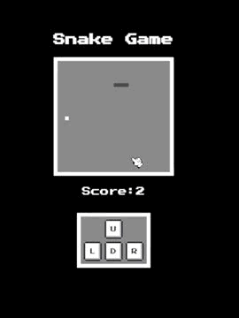

<h1>Snake Game</h1>

Volvamos a 1998 cuando jugabamos en nuestro Nokia el famoso juego de Snake, en este proyecto se puede jugar tanto con el keyboard, como con el control integrado en la interfaz

<h1>Preview del proyecto<h1>

<h1>Funciones principales</h1>
  <ul>
    <li>Controlar el juego por teclado y el control integrado.</li>
    <li>Se debe llevar un contador de los puntos ganados en la partida.</li>
    <li>Cuando el jugador pierde, notificarlo y preguntar si quiere intentarlo de nuevo.</li>
   
  </ul>
  
  <h1>Recursos utilizados</h1>
  <ul>
    <li><a href="https://www.w3schools.com/js/js_htmldom_eventlistener.asp"> JavaScript HTML DOM EventListener </a>
</li>
    
Documentación sobre los Event Listeners que podemos utilizar para manipular el DOM

    <li><a href="https://www.w3schools.com/jsref/jsref_pop.asp"> JavaScript Array pop() </a>
</li>
    
Documentación del método pop()

    <li><a href="https://www.w3schools.com/jsref/jsref_unshift.asp"> JavaScript Array unshift() </a>
</li>
    
Documentación del método unshift()

    <li><a href="https://www.w3schools.com/js/js_random.asp"> JavaScript Random </a>
</li>
    
Documentación del método para generar un número aleatorio()

    <li><a href="https://www.w3schools.com/jsref/prop_element_classlist.asp"> HTML DOM Element classList </a>
</li>
    
Documentación del método classList para manipular el DOM

  </ul>
  <h1>Código</h1>
  
Con toda libertad puedes bajar o clonar este repositorio!

  
Si tienes algún comentario o tienes una mejor forma de desarrollar el código, no dudes en comentarlo! Sharing Is Caring!

